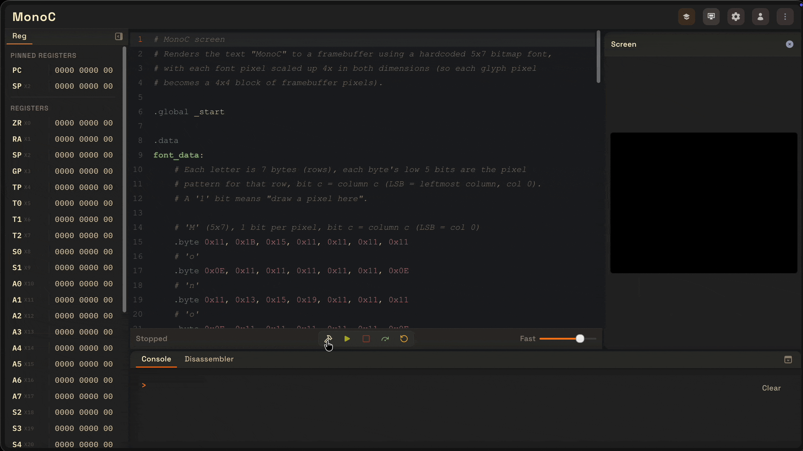
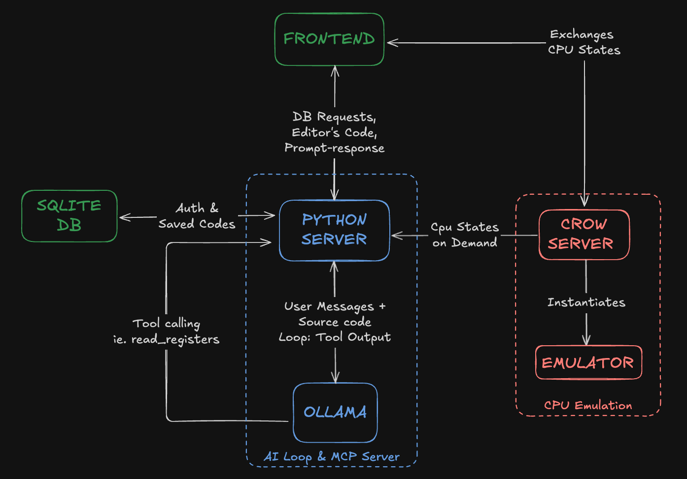
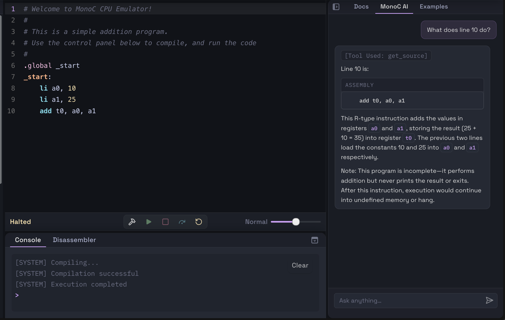

# MonoC
---

A 32-bit RISC-V CPU emulator and assembler, built from scratch in C++. MonoC implements the RV32I base instruction set and the M (integer multiplication/division) extension, exposed through a browser-based interface for writing, assembling, and executing RISC-V assembly.

Programs are written in an in-browser editor, assembled, and executed step-by-step or continuously on a CPU emulator with no dependency on external toolchains or simulators. The register file, memory, a memory-mapped framebuffer, and console I/O are exposed live during execution. Programs interact with the emulated machine through RISC-V `ecall` syscalls for integer, string, and character I/O, with runtime input accepted through an integrated terminal. Each session is backed by an isolated CPU instance on the server, allowing concurrent use without shared state between users.

The web app has documentation, example programs, and an integrated MCP powered AI assistant.



## Requirements
---
To run locally you need to have the following installed:

1. `uv`: Python package/project manager (handles the AI backend's dependencies):
   ```bash
   curl -LsSf https://astral.sh/uv/install.sh | sh
   ```
2. `crow`: C++ HTTP micro-framework for the backend server. Install it system-wide so the Makefile can find the headers:
   - macOS (Homebrew): `brew install crow`
   - Linux: `.deb` file from the [main repo](https://github.com/CrowCpp/Crow/releases)
   - **Windows: not tested, it is recommended to use emulation tools like WSL**
3. `npm`: Node.js package manager (ships with Node.js; used for the frontend)
4. `.env` (optional): copy `.env.example` to a new file named `.env` and set `OLLAMA_MODEL` to be the pulled model (see below). `GEMINI_API_KEY` is only needed for the Gemini fallback. 
5. `ollama` (optional): local LLM runtime for the AI assistant. Install from https://ollama.com, then pull a model, e.g.:
   ```bash
   ollama pull qwen3.5:9b
   ```

## Build
---

```bash
git clone https://github.com/NomadAvian/MonoC-CPU-Emulator
cd "MonoC-CPU-Emulator"
./start_monoc.sh 
```
Then open `http://localhost:5173` in your browser.

You can also use MonoC via Docker. For detailed guide check [hosting & usage guide](docs/hosting.md#hosting--usage-guide).

## Architecture & Tech Stack
---


- **Emulator**: C++20 from-scratch RV32 core (fetch / decode / execute), ALU with the M-extension, sparse unified RAM hosting a memory-mapped framebuffer
- **Assembler**: supports pseudo-instructions, labels, data directives and predefined constants (e.g. SCREEN).
- **Backend**: [Crow](https://crowcpp.org/) C++ REST server; each client session owns an isolated `SessionInstance` (CPU + per-session ROM + console I/O payload) managed by a thread-safe session registry.
- **Frontend**: React + Vite single-page app; Zustand stores for editor/emulator/console/memory state, CodeMirror editor (`@uiw/react-codemirror`), `motion` for panel animations.
- **AI service**: Python FastAPI microservice running a local LLM via Ollama (Gemini as fallback), wired to the emulator through tool calls so it can inspect live CPU state.


## References
---

1. [RISC-V Manual](https://docs.riscv.org/reference/isa/_attachments/riscv-unprivileged.pdf)
2. [RISC-V Assembly Programmer's Manual](https://zju-os.github.io/doc/spec/riscv-asm.pdf)
3. [Comprehensive Guide to RISCV Assembly](https://gist.github.com/robert-saramet/1b9ef3cac5a8345c90d84ac1ac4a8d2b)
4. [RARS Ecall Convention](https://github.com/TheThirdOne/rars/wiki/Environment-Calls)
