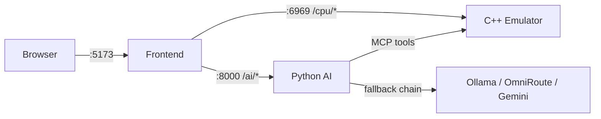
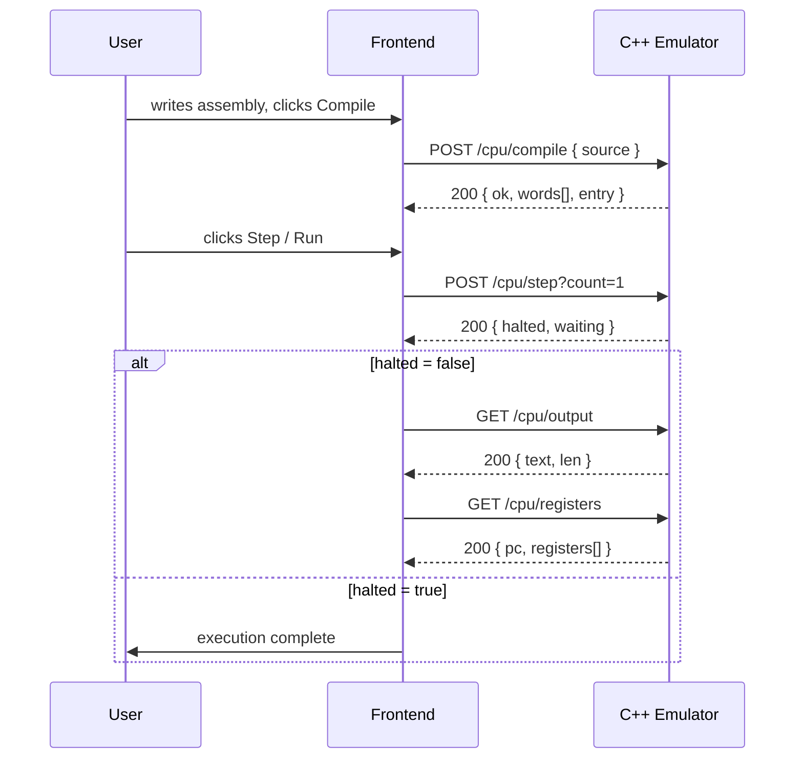
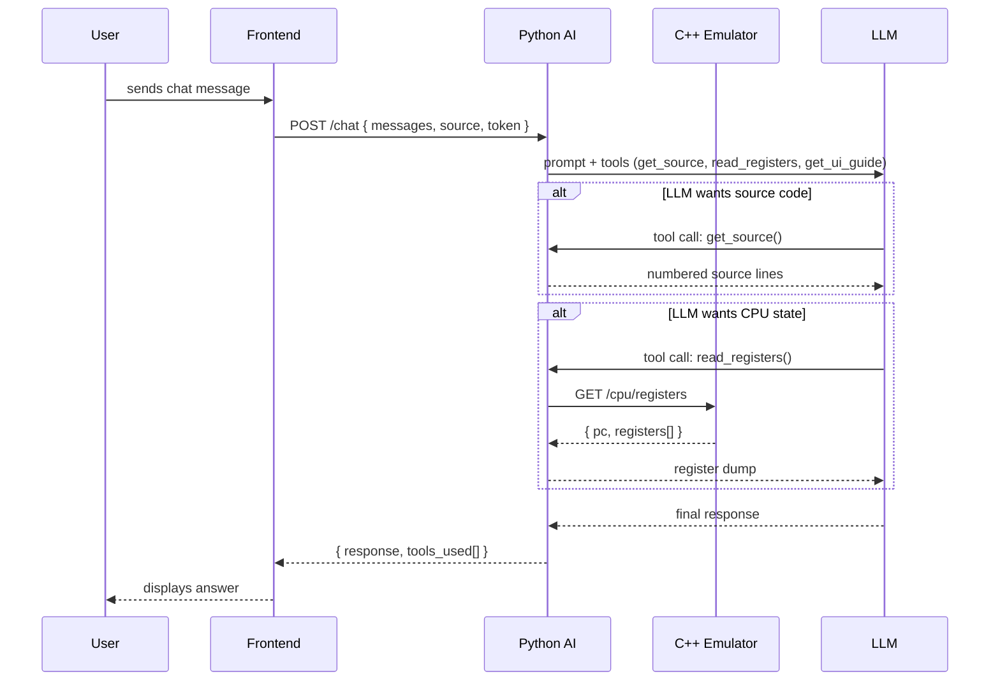

# MonoC API Diagrams

This Documentation gives a big pictures overview on the API Calls inside MonoC and how data flows.

```mermaid
graph LR
    Browser -->|":5173"| Frontend
    Frontend -->|":6969 /cpu/*"| CPP["C++ Emulator"]
    Frontend -->|":8000 /ai/*"| Python["Python AI"]
    Python -->|"MCP tools"| CPP
    Python -->|"fallback chain"| LLM["Ollama / OmniRoute / Gemini"]
```

## 1. C++ Emulator API

```mermaid
sequenceDiagram
    participant U as User
    participant F as Frontend
    participant C as C++ Emulator

    U->>F: writes assembly, clicks Compile
    F->>C: POST /cpu/compile { source }
    C-->>F: 200 { ok, words[], entry }

    U->>F: clicks Step / Run
    F->>C: POST /cpu/step?count=1
    C-->>F: 200 { halted, waiting }

    alt halted = false
        F->>C: GET /cpu/output
        C-->>F: 200 { text, len }
        F->>C: GET /cpu/registers
        C-->>F: 200 { pc, registers[] }
    else halted = true
        F->>U: execution complete
    end
```

## 2. AI Chat and MCP Tool Calls

```mermaid
sequenceDiagram
    participant U as User
    participant F as Frontend
    participant P as Python AI
    participant C as C++ Emulator
    participant L as LLM

    U->>F: sends chat message
    F->>P: POST /chat { messages, source, token }

    P->>L: prompt + tools (get_source, read_registers, get_ui_guide)

    alt LLM wants source code
        L->>P: tool call: get_source()
        P-->>L: numbered source lines
    end

    alt LLM wants CPU state
        L->>P: tool call: read_registers()
        P->>C: GET /cpu/registers
        C-->>P: { pc, registers[] }
        P-->>L: register dump
    end

    L-->>P: final response
    P-->>F: { response, tools_used[] }
    F-->>U: displays answer
```